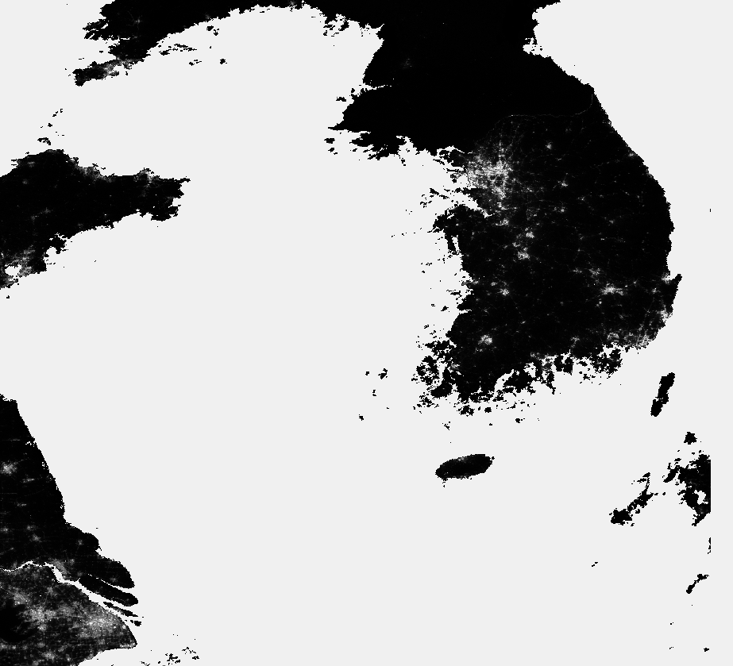
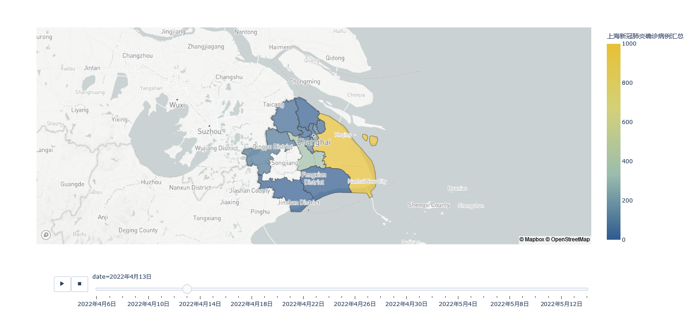
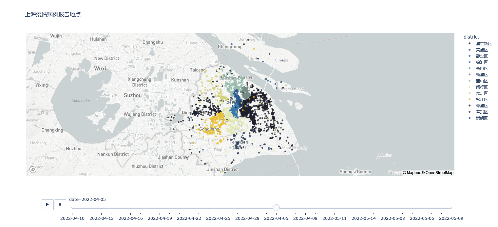
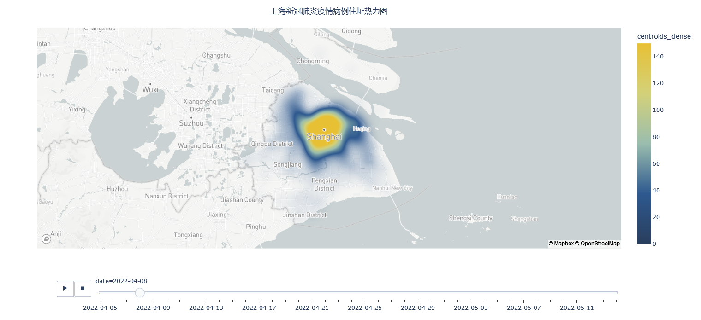
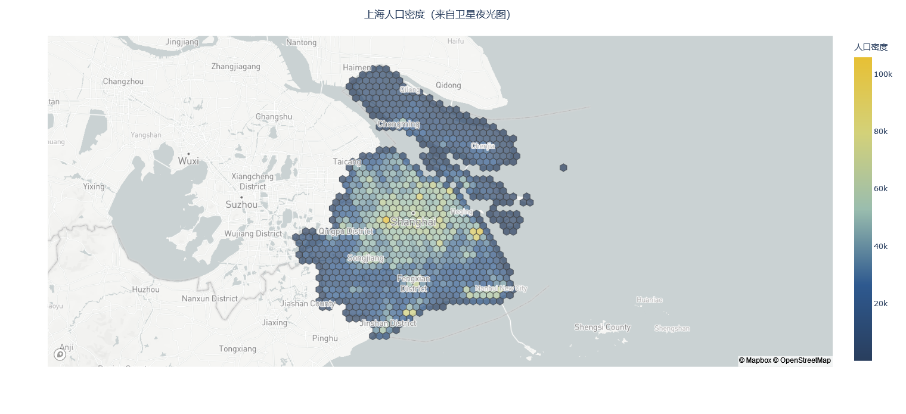

# 上海2022春COVID疫情数据可视化
# Visualization on COVID-19 related data of Shanghai in 2022 spring.

演示动画：https://www.bilibili.com/video/BV1VY4y1t7iF

探索数据：https://hyder.top/2022/05/16/%E4%B8%8A%E6%B5%B72022%E7%96%AB%E6%83%85%E5%A4%A7%E6%95%B0%E6%8D%AE%E5%8F%AF%E8%A7%86%E5%8C%96/

使用前请先获取.mapbox_token，并放入/src路径下。

## 1.背景
2022年3月底至5月初，上海迎来了一波新冠疫情的高峰。为了更科学地理解和把握上海疫情地发展规律，根据上海是卫建委发布的[疫情通报数据](https://wsjkw.sh.gov.cn/yqtb/index.html)，绘制了多幅可视化作品。

数据包括了旬日的分区确诊病例、无症状感染者总人数统计，以及确诊病例、无症状感染者的居住地址。使用网络爬虫技术获取了这些数据，并使用Pandas制作了数据集。由此制作了分区旬日统计数据地图，该图可以有助于从宏观把握疫情态势。

由于原始数据的地址是道路+门牌号形式，为了更直观地展现，使用[高德地图API](https://lbs.amap.com/)进行了地理位置信息编码，获取了经纬度信息，并以此展示了通报病例（确诊病例和无症状感染者）地居住地址的旬日散点地图。该散点图可以从微观上协助把握了解疫情发生地。

由于散点图数量太多，很难直观把握全局信息，因此使用聚类分析得到了疫情集中暴发点。据此，绘制了旬日热力地图，该图有助于了解疫情集中暴发点及其动态变化过程。

最后，从专业角度出发，获取了VIIRS卫星载荷的夜光数据[VNP46A2(DOI:10.5067/VIIRS/VNP46A2.001)](https://ladsweb.modaps.eosdis.nasa.gov/missions-and-measurements/products/VNP46A2/)，绘制了人口密度六边形图。该图用以指示上海市的生产生活强度，为研究上海市疫情期间的生成生活变化、上海市复工复产情况以及上海市供应链紧张问题提供了参考。

下面具体介绍数据以及各组可视化作品的制备过程。

## 2.数据
上海卫建委发布的[疫情通报数据](https://wsjkw.sh.gov.cn/yqtb/index.html)主要包括了两种感兴趣数据，分别是新增本土确诊病例、本土无症状感染者、境外确诊病例和境外无症状感染者的统计数据，以及各行政区新增本土确诊病例、本土无症状感染者的居住地信息。

使用Python环境下的Request、BeautifulSoup等包构建了[爬虫程序](src/get_metadata.ipynb)，获取了数据，并使用pandas构建数据集并存储为本地离线.csv数据。数据分为住址数据和统计数据。在住址数据的基础上，进一步得到了了暴发中心数据。

下面分别介绍数据处理过程。

### 2.1 统计数据

统计数据直接获取自卫建委通报：

|浦东新区|	黄浦区|	静安区|	徐汇区|	长宁区|	普陀区|	虹口区|	杨浦区|	宝山区|
|---|---|---|---|---|---|---|---|---|
|8306|	1035|	518|	1088|	319|	1006|	667|	618|	651|
|...|	...|	...|	...|	...|	...|	...|	...|	...|

|闵行区|	嘉定区|	金山区|	松江区|	青浦区|	奉贤区|	崇明区|	date|
|---|---|---|---|---|---|---|---|
|	2388|	1402|	76|	779|	466|	278|	63|	2022年4月6日|
|	...|	...|	...|	...|	...|	...|	...|	...|

### 2.2 住址数据
原始住址数据仅包含了地址、区，若要直观展示，需要获取经纬度等地理空间坐标。使用[高德地图API](https://lbs.amap.com/)进行了地理信息编码，将字符串格式的地址转化成了经纬度坐标。当然，由于不可避免地存在重名、人工录入失误等因素，该数据或多或少存在着噪声数据。处理后的住址数据包含了日期、区、地址、经纬度坐标，其格式如下：

|date|	district|	address|	lons|	lats|
|---|---|---|---|---|
|2022/4/5|	浦东新区|	百曲村|	121.526077|	30.962523|
|...|	...|	...|	...|	...|
|2022/5/14|	青浦区|	宅东新区|	121.3008|	31.171559|

### 2.3 暴发中心数据
原始住址数据数量众多，为了凝练数据，更简练地展示疫情暴发中心，将每天地住址数据按照经纬度坐标进行了聚类处理，得到了100个聚类中心。这里的聚类算法采用了经典的K-Means聚类。聚类中心作为标签，为每个聚类中心统计了当天病例住址数据中距离该聚类中心最近的点的总数，作为该聚类中心的病例总数。

为了增强聚类中心的指示意义，使用[高德地图API](https://lbs.amap.com/)进行了逆地理信息编码，将经纬度转化为了行政区、街道、街区、建筑等字符串格式的位置信息，以便于直观理解。

聚类结果即为暴发中心数据，存储到了.csv文件中，该数据格式如下：

|lon|	lat|	centroids_dense|	district|	township|	neighborhood|	building|	streetNumber|	date|
|---|---|---|---|---|---|---|---|---|
|121.6917933|	31.19298604|	78|	浦东新区|	川沙新镇|	[]|	[]|	进贤路|	2022/4/5|
|...|...|...|...|...|...|...|...|...|
|121.3008|	31.171559|	1|	青浦区|	徐泾镇|	[]|	[]|	沪青平公路|	2022/5/14|

### 2.4 卫星夜光数据
卫星夜光数据来自VIIRS卫星载荷的夜光数据L1B产品[VNP46A2(DOI:10.5067/VIIRS/VNP46A2.001)](https://ladsweb.modaps.eosdis.nasa.gov/missions-and-measurements/products/VNP46A2/)，数据以.h5格式存储。

使用hdpy5、netCDF4包读取并解析了卫星数据。卫星数据包含了数据属性和数据内容，数据内容主要包括了若干影像，其中有最新影像 “DNB_BRDF-Corrected_NTL”，不过该影像数据受上海浓云遮挡，数据质量较低；因此使用了多日影像处理结果的“Gap_Filled_DNB_BRDF-Corrected_NTL”影像。

图像包含了广大的区域，因为仅对上海市内的灯光数据感兴趣，因此需要对影像进行筛选。首先根据经纬度数据裁取了包含上海市的方框内的数据。之后，将数据转为geopandas包的GeoDataFrame格式，以便于利用shapely包进行几何掩膜化。几何掩膜化过程使用的掩膜为json格式的上海行政区多边形掩膜，数据来自[高德开放平台](https://lbs.amap.com/demo/javascript-api/example/overlayers/geojson)。

最后，对夜光图进行校正，并拟合了上海市人口数据。

卫星数据处理的相关代码在[satellite.ipynb](src/satellite.ipynb)。

## 3.可视化

使用上述数据，通过Plotly工具绘制了若干可视化作品。作品配色灵感来自梵高的《星空》。可视化的相关代码在卫星数据处理的相关代码在[draw_graph.ipynb](src/draw_graph.ipynb)。

### 3.1 统计地图
有两幅地图，分别为本土新增确诊病例、无症状感染者统计数据。颜色对应每个行政区的病例数量。时间轴对应了数据时间。

根据统计地图可以明显地看到上海4月中下旬3轮新增高峰，疫情从浦东扩撒到浦西，在5月分后疫情直接稳定，新增病例不断减少。

### 3.2 确诊地址散点地图
使用了住址数据。散点的位置对应了病例住址的经纬度，散点的颜色对应行政区，时间轴对应了数据时间。

根据该图可以看到疫情从浦东到浦西、从市中心到外围的扩散态势，也可以看到病例的具体地点。

### 3.3 确诊地址热力图
可以看到4月初期疫情蔓延趋势，疫情中心也从浦东来到了浦西老城区。经历了严格的封城措施后，疫情在4月底出现明显抑制趋势，并在5月明显减少。

热力图也揭示了疫情高发的社区，比如老西门街道的早期教育中心周边、打浦桥街道的顺风公寓周边、洋泾街道、潍坊新村街道的泉东小区等地。

## 3.4 人口密度图
虽然受天气影像数据质量较低，但是人口密度图依然指示了疫情期间居民生产生活强度，具有为研究上海市疫情期间的生成生活变化、上海市复工复产情况以及上海市供应链紧张问题提供参考的潜力。该功能还需要进一步完善。

